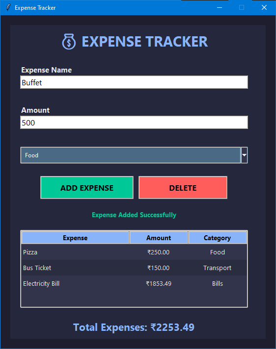

# 💰 Expense Tracker

A modern desktop Expense Tracker built with **Python**, **Tkinter**, and **ttk** that helps users record, categorize, and manage their expenses through a clean and professional dark-themed interface.

## Features

* Add expenses with a name, amount, and category
* Delete selected expenses instantly
* Automatic total expense calculation
* Persistent data storage using JSON
* Input validation to prevent invalid entries
* Modern dark-themed UI
* Professional table view using Treeview
* Categorized expense management

## Screenshot

## Technologies Used

* Python 3
* Tkinter
* ttk
* JSON

## How It Works

1. Enter the expense name.
2. Enter the expense amount.
3. Select a category.
4. Click **ADD EXPENSE**.
5. View all expenses in the table.
6. Select any expense and click **DELETE** to remove it.
7. The total expenses are automatically updated and displayed at the bottom.

## Future Improvements

* Expense editing functionality
* Search and filter options
* Monthly spending reports
* Charts and visual analytics
* Export to CSV or Excel
